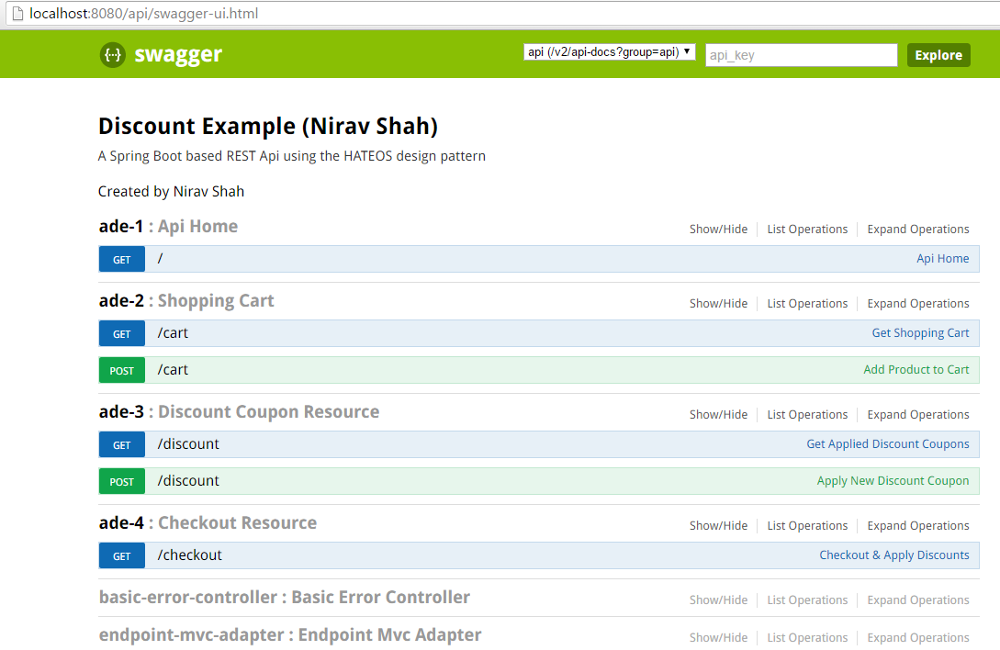
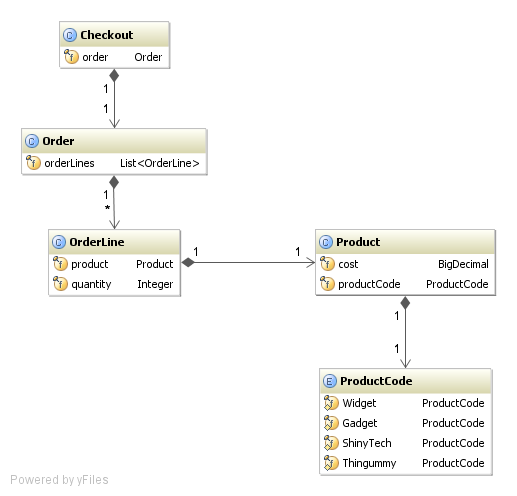

# Discount Example - Nirav Shah #

The requirements below have been implemented using a Spring Boot based REST API using the HATEOAS design pattern.

## REST Resources ##

There are four REST resources:

1. Home Resource (/api) - This resource responds to a GET call and lists down the functionality that the app exposes
2. Cart Resource (/api/cart) - This resource responds to GET & POST methods. The GET method shows the current items in the cart and the POST method lets you add a new item to the cart.
3. Discount Coupon Resource (/api/discount) - This resource responds to GET & POST methods to get the current discount coupons added to the cart and add new discount coupon

`currently the only coupon code configured is ORBIT50 for 50% discount. more can be added`

4. Checkout - This resource responds to the GET method and calculates all the applicable discounts and displays the final cart total.

## Discounts Configuration ##

The discount logic is implemented using Drools rules. Three discounts have been added currently, but more can easily be added to the drools file.

1. Product Line Level Discounts - Currently a 3 for 2 discount is configured to be applicable at each product line.
2. Cart Level Discounts - Either one of the below discounts are applied (if both are selected)
..* Coupon Code - 'ORBIT50' gives you a discount of 50%
..* 10% off £50 

## Running the Example ##

`gradlew clean build && java -jar build\libs\discountexample-nirav-shah-0.1.0.jar`

The above command will start the Spring Boot Application (with Swagger UI) on port 8080

## Accessing the application ##

### Browser ###

`http://localhost:8080/api`

### Swagger UI ###

The Swagger UI is accessible at : `http://localhost:8080/api/swagger-ui.html`
The resources that have been added as part of this example have the tage `ade` ahead of them.

The below fours resources have been implmented

---

# Orbit Java Coding Test - Welcome! #

As discussed on the phone, we have a coding test we'd like you to complete
which forms the next stage of the interview process for [Orbit](http://www.orbitbenefits.com).  

This is a fork which has been created for you specifically,
please clone it locally via Git.  Make your changes, commit as often as you
need and then push it back to origin when you're happy it's complete.

## The Task ##

Below is the current, simple class model in the existing code.

You must implement the following requirements, adding or changing code as 
required:

 1. 10% off the total for orders totalling £50 or more
 2. 3 items for the price of 2 when buying multiple items of the same product
 3. Discount Voucher

The requirements are deliberately vague in order to force you to make some
choices of your own.  Please make what assumptions you think are needed based
on your own experiences with shopping and discounts. If you wish you could
update or replace this README with details of any assumptions made, or leave 
suitable comments in the code.

Let your recruiter know when you've finished and pushed back and we'll take a
look.  Happy coding :-)

### How do I get set up? ###

* Clone using the URL at the top of the bitbucket home page for this fork
* Open in your favourite IDE or text editor (we have included project files for gradle, Eclipse/STS and IntelliJ to speed this up)

### Contribution guidelines ###

* Use any tools and resources you like
* Hack code
* Commit/Push

### Anything else? ###

* We think a reasonable solution to this should take 2-4 hours in total.. there's no deadline, most people push something back within a few days
* Contact the recruiter with any issues and the right person will get back to you